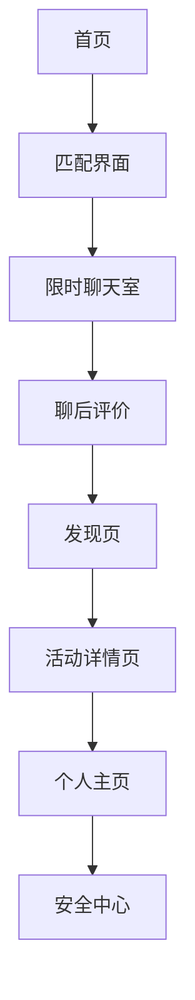

## 1. 产品概述
闪玩是一款基于兴趣标签与地理位置的即时社交应用，通过限时聊天促进用户快速破冰，并以活动信息流推动线下社交转化。本静态演示DEMO旨在展示核心界面设计与交互流程，为后续开发提供视觉参考。

目标用户：新城市社交人群、同好结识需求者、轻量交友与活动参与者。
产品价值：降低社交门槛，提升匹配效率，保障社交安全，促进真实线下互动。

## 2. 核心功能

### 2.1 用户角色
| 角色 | 注册方式 | 核心权限 |
|------|----------|----------|
| 普通用户 | 手机号+验证码注册 | 浏览匹配界面、查看活动信息、体验核心交互流程 |
| 演示访客 | 无需注册 | 仅浏览静态界面，无实际操作权限 |

### 2.2 功能模块
闪玩静态演示DEMO包含以下核心页面：
1. **首页**：展示应用核心价值主张、快速匹配入口、信用体系介绍
2. **匹配界面**：兴趣标签配置、地理位置展示、一键匹配按钮
3. **限时聊天室**：5分钟倒计时、消息气泡界面、实时翻译展示
4. **聊后评价**：多维度评价界面、匿名评价选项、关系沉淀入口
5. **发现页**：活动信息流、智能推荐卡片、分类筛选功能
6. **活动详情页**：活动信息展示、安全保障说明、报名入口
7. **个人主页**：三维标签系统展示、基础信息展示、编辑入口
8. **安全中心**：安全等级展示、实名认证引导、紧急联系人设置

### 2.3 页面详情
| 页面名称 | 模块名称 | 功能描述 |
|----------|----------|----------|
| 首页 | Hero区域 | 展示"一键闪聊，遇见同好"核心标语，配动态背景图 |
| 首页 | 价值主张 | 轮播展示三大卖点：即时匹配、限时聊天、活动发现 |
| 首页 | 快速入口 | 提供"开始匹配"和"浏览活动"两个主要CTA按钮 |
| 匹配界面 | 标签配置区 | 展示预设兴趣标签（摄影、露营、烹饪等），支持多选 |
| 匹配界面 | 位置信息 | 显示当前位置范围设置（1km-50km可调） |
| 匹配界面 | 匹配按钮 | 中央醒目的一键匹配按钮，展示匹配状态 |
| 限时聊天室 | 倒计时器 | 顶部固定5分钟倒计时，支持延时申请 |
| 限时聊天室 | 消息区域 | 展示模拟聊天消息，支持文本/语音/表情 |
| 限时聊天室 | 功能浮层 | 展示实时翻译、举报、救助等功能入口 |
| 聊后评价 | 评价维度 | 体验、匹配度、印象三个维度的星级评价 |
| 聊后评价 | 标签评价 | 提供"友善"、"有趣"等快捷评价标签 |
| 聊后评价 | 关系选择 | 加为聊友、发起线下邀约、匿名评价选项 |
| 发现页 | 信息流 | 无限滚动的活动卡片，展示主图、标题、时间 |
| 发现页 | 筛选器 | 分类标签（运动、文艺、美食等）、时间筛选 |
| 发现页 | 推荐算法 | 基于兴趣标签和地理位置的智能推荐展示 |
| 活动详情页 | 信息展示 | 活动标题、时间地点、费用说明、注意事项 |
| 活动详情页 | 安全保障 | 实名认证、保险覆盖、专业领队信息展示 |
| 活动详情页 | 社交元素 | 已报名用户头像墙、分享收藏功能 |
| 个人主页 | 三维标签 | 身份标签、兴趣技能标签、情绪状态标签展示 |
| 个人主页 | 基础信息 | 头像、昵称、年龄、职业等基础信息展示 |
| 个人主页 | 编辑功能 | 标签编辑、信息修改、隐私设置入口 |
| 安全中心 | 等级展示 | 综合安全评分展示（0-100分） |
| 安全中心 | 认证引导 | 实名认证、紧急联系人、行程分享等功能引导 |
| 安全中心 | 安全知识 | 安全自评答题、安全提示信息展示 |

## 3. 核心流程
用户首次访问流程：首页 → 匹配界面 → 限时聊天室 → 聊后评价 → 发现页浏览 → 活动详情查看

功能探索流程：个人主页设置 → 安全中心认证 → 发现页筛选 → 活动报名 → 小队空间预览

## 4. 用户界面设计

### 4.1 设计风格
- 主色调：活力橙(#FF6B35)配合纯净白(#FFFFFF)，营造年轻活力的社交氛围
- 辅助色：科技蓝(#4A90E2)用于强调和安全相关元素
- 按钮样式：圆角矩形设计，主要操作使用渐变色填充
- 字体：中文使用思源黑体，数字使用SF Pro Display，保证清晰度
- 布局风格：卡片式布局为主，重要功能采用底部固定导航
- 图标风格：线性图标配合面性图标，保持视觉一致性

### 4.2 页面设计概述
| 页面名称 | 模块名称 | UI元素 |
|----------|----------|--------|
| 首页 | Hero区域 | 全屏渐变背景，中央核心标语，底部浮动操作按钮 |
| 匹配界面 | 标签区域 | 彩色胶囊标签，选中状态使用主色调填充 |
| 匹配界面 | 匹配按钮 | 大型圆形按钮，带动画效果，匹配中时显示加载状态 |
| 聊天室 | 消息气泡 | 用户消息使用白色气泡，对方消息使用浅灰色气泡 |
| 聊天室 | 倒计时 | 顶部进度条配合数字倒计时，最后30秒变为橙色警告 |
| 评价页 | 星级评价 | 大型可点击星星，hover效果，选中后高亮显示 |
| 发现页 | 活动卡片 | 圆角卡片设计，图片占2/3高度，信息区域占1/3 |
| 详情页 | 信息层级 | 标题最大字号，关键信息使用图标+文字组合展示 |
| 个人页 | 标签云 | 不同大小和颜色的标签，形成视觉层次感 |
| 安全页 | 等级环 | 圆形进度环展示安全等级，中心显示具体分数 |

### 4.3 响应式设计
采用桌面优先设计策略，确保在PC端有最佳展示效果。同时适配平板和手机端：
- 桌面端：最大宽度1200px，多列布局展示更多信息
- 平板端：最大宽度768px，调整网格布局为2列
- 手机端：单列布局，重要功能固定在底部导航栏

### 4.4 交互动效
- 页面切换：使用滑动切换动画，提升流畅感
- 按钮反馈：点击时的缩放效果和涟漪扩散动画
- 加载状态：骨架屏配合脉冲动画，提升等待体验
- 成功反馈：使用勾选动画和成功提示，增强操作确定性