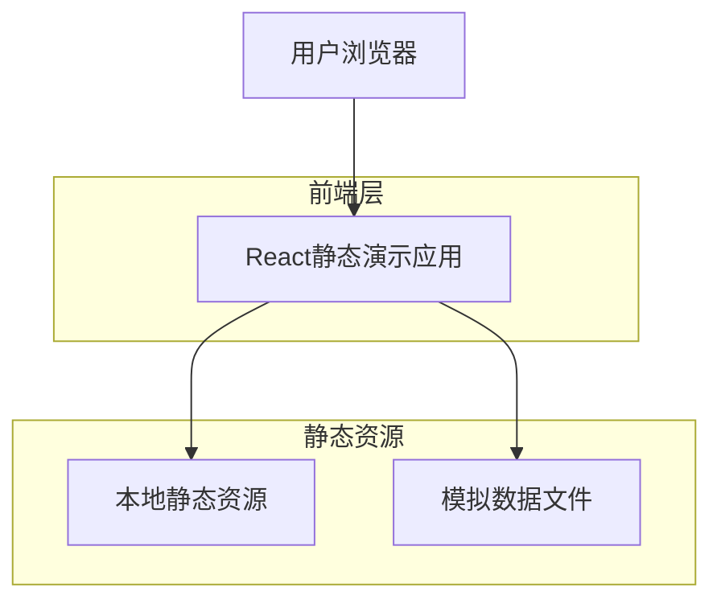

## 1. 架构设计

闪玩静态演示DEMO采用纯前端架构，专注于界面展示和交互演示，无需后端服务支持。



## 2. 技术描述

- 前端：React@18 + Vite + TypeScript
- 样式：TailwindCSS@3 + 自定义CSS变量
- 初始化工具：vite-init
- 路由：React Router@6
- 状态管理：React Context + useReducer
- 动画：Framer Motion
- 图标：React Icons + 自定义SVG
- 后端：无（纯静态演示）

## 3. 路由定义

| 路由 | 用途 |
|------|------|
| / | 首页，展示应用核心价值主张和快速入口 |
| /match | 匹配界面，展示兴趣标签配置和匹配功能 |
| /chat | 限时聊天室，展示5分钟倒计时和聊天界面 |
| /evaluate | 聊后评价页面，展示多维度评价界面 |
| /discover | 发现页，展示活动信息流和筛选功能 |
| /activity/:id | 活动详情页，展示具体活动信息和报名入口 |
| /profile | 个人主页，展示三维标签系统和基础信息 |
| /safety | 安全中心，展示安全等级和认证引导 |

## 4. 核心组件结构

### 4.1 页面级组件
- `HomePage`: 首页组件，包含Hero区域和价值主张展示
- `MatchPage`: 匹配界面组件，包含标签配置和匹配按钮
- `ChatRoom`: 聊天室组件，包含倒计时和消息展示
- `EvaluationPage`: 评价页面组件，包含星级评价和标签选择
- `DiscoverPage`: 发现页组件，包含活动卡片和筛选器
- `ActivityDetail`: 活动详情组件，包含信息展示和报名功能
- `ProfilePage`: 个人主页组件，包含三维标签展示
- `SafetyCenter`: 安全中心组件，包含等级展示和认证引导

### 4.2 通用组件
- `Navigation`: 底部导航栏组件
- `ActivityCard`: 活动卡片组件
- `TagSelector`: 标签选择器组件
- `StarRating`: 星级评价组件
- `CountdownTimer`: 倒计时器组件
- `MessageBubble`: 消息气泡组件
- `SafetyLevel`: 安全等级展示组件

### 4.3 数据模型定义

#### 用户模型
```typescript
interface User {
  id: string;
  nickname: string;
  avatar: string;
  age: number;
  career: string;
  location: {
    lat: number;
    lng: number;
    city: string;
  };
  tags: {
    identity: string[];
    interests: string[];
    mood: string;
  };
  creditScore: number;
  safetyLevel: number;
}
```

#### 活动模型
```typescript
interface Activity {
  id: string;
  title: string;
  description: string;
  time: string;
  location: string;
  price: number;
  budget: number;
  tags: string[];
  image: string;
  participants: User[];
  maxParticipants: number;
  organizerVerified: boolean;
  safetyInsurance: boolean;
}
```

#### 消息模型
```typescript
interface Message {
  id: string;
  senderId: string;
  content: string;
  type: 'text' | 'voice' | 'emoji';
  timestamp: number;
  translated?: string;
}
```

#### 评价模型
```typescript
interface Evaluation {
  sessionId: string;
  experience: number;
  match: number;
  impression: number;
  tags: string[];
  anonymous: boolean;
  comment?: string;
}
```

## 5. 静态数据配置

### 5.1 模拟用户数据
```typescript
const mockUsers: User[] = [
  {
    id: 'user1',
    nickname: '小明',
    avatar: '/avatars/user1.jpg',
    age: 25,
    career: '摄影师',
    location: { lat: 31.2304, lng: 121.4737, city: '上海' },
    tags: {
      identity: ['摄影师', '90后'],
      interests: ['摄影', '露营', '咖啡'],
      mood: '探索新事物'
    },
    creditScore: 85,
    safetyLevel: 80
  }
  // ... 更多用户数据
];
```

### 5.2 模拟活动数据
```typescript
const mockActivities: Activity[] = [
  {
    id: 'activity1',
    title: '周末户外摄影采风',
    description: '一起探索城市美景，交流摄影技巧',
    time: '2024-01-20 14:00',
    location: '中山公园',
    price: 0,
    budget: 50,
    tags: ['摄影', '户外', '社交'],
    image: '/activities/photography.jpg',
    participants: [],
    maxParticipants: 10,
    organizerVerified: true,
    safetyInsurance: true
  }
  // ... 更多活动数据
];
```

### 5.3 预设标签数据
```typescript
const interestTags = {
  运动: ['跑步', '健身', '瑜伽', '游泳', '骑行'],
  文艺: ['摄影', '绘画', '音乐', '读书', '写作'],
  美食: ['咖啡', '烘焙', '品酒', '料理', '探店'],
  户外: ['露营', '徒步', '攀岩', '钓鱼', '滑雪'],
  技能: ['编程', '设计', '语言', '手工', '调酒']
};

const identityTags = [
  '90后', '95后', '00后', '程序员', '设计师', 
  '摄影师', '教师', '医生', '律师', '创业者'
];

const moodTags = [
  '探索新事物', '享受独处', '寻找知己', '扩展社交圈',
  '学习新技能', '放松解压', '冒险挑战', '文化交流'
];
```

## 6. 开发配置

### 6.1 项目结构
```
src/
├── components/          # 通用组件
│   ├── common/         # 基础组件
│   ├── navigation/     # 导航组件
│   └── ui/             # UI组件
├── pages/              # 页面组件
├── hooks/              # 自定义Hooks
├── utils/              # 工具函数
├── data/               # 模拟数据
├── assets/             # 静态资源
├── styles/             # 样式文件
└── types/              # TypeScript类型定义
```

### 6.2 环境配置
```bash
# 开发环境
npm run dev

# 构建生产版本
npm run build

# 预览构建结果
npm run preview
```

### 6.3 关键依赖
```json
{
  "dependencies": {
    "react": "^18.2.0",
    "react-dom": "^18.2.0",
    "react-router-dom": "^6.8.0",
    "framer-motion": "^10.0.0",
    "react-icons": "^4.7.0",
    "clsx": "^1.2.0"
  },
  "devDependencies": {
    "@types/react": "^18.0.0",
    "@types/react-dom": "^18.0.0",
    "@vitejs/plugin-react": "^3.1.0",
    "autoprefixer": "^10.4.0",
    "postcss": "^8.4.0",
    "tailwindcss": "^3.2.0",
    "typescript": "^4.9.0",
    "vite": "^4.1.0"
  }
}
```

## 7. 部署方案

### 7.1 静态部署
由于本项目为纯静态演示，可直接部署到任何静态文件托管服务：
- Vercel：零配置部署，支持自定义域名
- Netlify：拖拽部署，支持分支预览
- GitHub Pages：免费托管，适合开源项目
- 阿里云OSS：国内访问速度快，支持CDN加速

### 7.2 构建优化
- 图片压缩：使用vite-plugin-imagemin优化图片资源
- 代码分割：按路由进行代码分割，减少首屏加载时间
- 预加载：对关键资源进行预加载处理
- 缓存策略：配置合理的缓存策略，提升二次访问速度